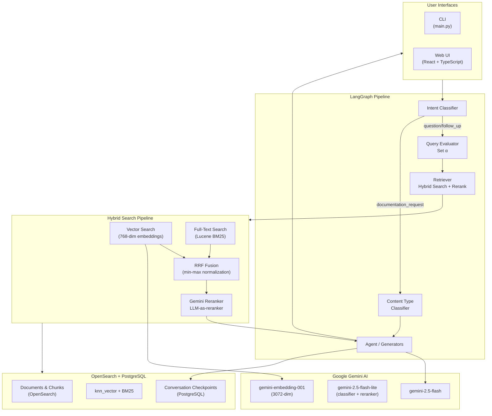

# Rusty Compass

A production-grade **LangGraph agent** with real-time streaming, hybrid search,
LLM-based reranking, and multi-capability intent routing. Deployed on
**GCP Cloud Run** with Google Gemini AI.

## Quick Start

### Local Development

```bash
cd langchain_agent
./scripts/setup.sh    # One-time setup (10-20 min)
./scripts/start.sh    # Start backend + frontend → http://localhost:5173
```

### Cloud Deployment (GCP)

```bash
cd langchain_agent
./scripts/deploy.sh --project <GCP_PROJECT_ID>
```

Deploys to Cloud Run with Cloud SQL (PostgreSQL), OpenSearch (document search),
Secret Manager, and Artifact Registry. Scales to zero when idle.

## What is It?

A multi-capability RAG agent powered by Google Gemini AI that combines:

- **Three Operating Modes** - RAG Q&A, Config Builder, Documentation Writer
- **Intent Classification** - 5 intents (question, config_request,
  documentation_request, summary, follow_up) with 95%+ accuracy
- **Content Type System** - 5 content types (social post, blog, technical
  article, tutorial, comprehensive docs) with code-based vagueness detection
- **LangGraph Pipeline** - Deterministic graph-based orchestration with
  dynamic query evaluation and conditional routing
- **Hybrid Search** - Vector + full-text search with Reciprocal Rank
  Fusion (RRF)
- **LLM-Based Reranking** - Gemini Flash Lite reranker for improved
  relevance scoring
- **Dynamic Alpha** - Query-aware lexical/semantic balance with
  bidirectional refinement
- **Real-Time Streaming** - Token-by-token output via WebSocket with
  cancellation support
- **Observability Panel** - Live pipeline visualization showing every node
  execution, timing, search scores, and classification details
- **Smart Citations** - GitHub-linked document references with
  relevance-based suppression

## Architecture

### System Overview



### Agent Pipeline Flow

```text
intent_classifier
  ├── question/follow_up → query_expansion → query_evaluator → retriever → alpha_refiner → agent
  ├── config_request     → config_resolver → config_generator → config_response
  ├── documentation_request → content_type_classifier
  │     ├── social_post         → social_content_generator
  │     ├── blog_post           → blog_content_generator
  │     ├── technical_article   → article_content_generator (3 retrieval passes)
  │     ├── tutorial            → tutorial_generator
  │     ├── comprehensive_docs  → doc_planner → doc_synthesizer (5 section passes)
  │     ├── missing_format      → format_clarification → (re-classify)
  │     └── missing_topic       → topic_clarification → (re-classify)
  ├── summary            → summary
  └── follow_up          → query_expansion → query_evaluator → retriever → agent
```

### Content Type System

| Type | Target Length | Temp | Retrieval Passes | Typical Time |
| ------ | ------------- | ------ | ------------------ | ------------- |
| social_post | 200 words | 0.8 | 1 | ~6s |
| blog_post | 1500 words | 0.7 | 2 | ~20s |
| technical_article | 1200 words | 0.5 | 3 | ~25s |
| tutorial | 1000 words | 0.4 | 2 | ~20s |
| comprehensive_docs | 2500 words | 0.3 | 5 sections | ~50s |

When a documentation request is missing format or topic, code-based
vagueness detection identifies what's missing and asks for clarification
before proceeding.

## Tech Stack

| Category | Technology | Purpose |
| ---------- | ----------- | --------- |
| **LLM** | gemini-2.5-flash | Primary reasoning and generation |
| **Classifier** | gemini-2.5-flash-lite | Intent + content type classification |
| **Embeddings** | gemini-embedding-001 | 768-dimensional semantic vectors |
| **Reranker** | gemini-2.5-flash-lite | LLM-as-reranker relevance scoring |
| **Agent Framework** | LangGraph + LangChain | Graph-based pipeline orchestration |
| **Vector Database** | OpenSearch | 768-dim knn_vector with Lucene engine |
| **Full-Text Search** | OpenSearch (BM25) | Keyword search with Lucene analyzer |
| **Memory** | PostgreSQL (Cloud SQL) | LangGraph checkpoints + conversation metadata |
| **Backend API** | FastAPI + WebSocket | REST API with real-time streaming |
| **Frontend** | React 18 + TypeScript + Tailwind | Web UI with Zustand state management |
| **Deployment** | GCP Cloud Run + Cloud SQL | Serverless container deployment |
| **Containerization** | Docker (multi-stage) | Frontend build + Python runtime |

## Example Queries

**RAG Q&A** (question intent):

```text
What is a Lucille Connector and how does it work?
```

**Config Builder** (config_request intent):

```text
Build me a CSV to OpenSearch pipeline with a regex stage
```

**Documentation Writer** (documentation_request intent):

```text
Write a technical article about the FileConnector
Write a LinkedIn post about Lucille's stage architecture
Create comprehensive documentation for the OpenSearch indexer
Write a tutorial on building custom connectors
```

**Summary** (summary intent):

```text
Summarize our conversation so far
```

**Follow-up** (follow_up intent):

```text
How about combining them?   → auto-expands with conversation context
```

## Observability Panel

The web UI includes a real-time observability panel that shows:

- **Intent Classification** - Detected intent with confidence score
- **Query Evaluation** - Alpha value and query type classification
- **Content Type Classification** - Detected content type with confidence
- **Hybrid Search Results** - Vector + full-text scores, RRF fusion
- **Reranker Results** - Per-document relevance scores
- **Alpha Refinement** - Retry strategy when initial search scores low
- **Config Resolver** - Per-component resolution details (spec-matched
  vs search-fallback), class names, and descriptions
- **Token Streaming** - Live generation progress with timing

Each pipeline node shows execution time, status (running/complete/skipped),
and expandable detail cards.

## Key Techniques

| Technique | Description |
| ----------- | ------------- |
| **Intent Classification** | 5-intent detection (95%+ accuracy) using keyword fast-path + LLM fallback |
| **Content Type Classification** | 5 content types with code-based vagueness detection for missing format/topic |
| **Config Builder** | Generates HOCON pipeline configurations from natural language with component spec matching |
| **Documentation Writer** | Multi-pass content generation with per-type temperature and retrieval strategies |
| **Reciprocal Rank Fusion** | Combines vector and full-text rankings: `score = Σ 1/(rank + k)` where k=60 |
| **LLM-Based Reranking** | Gemini Flash Lite scores query-document relevance (0.0-1.0) |
| **Dynamic Alpha** | Query evaluator classifies query type and sets optimal α for hybrid search balance |
| **Bidirectional Alpha Refinement** | Retries with opposite search strategy if max relevance < 0.5 |
| **Smart Citations** | GitHub-linked references with suppression when max relevance < 10% |
| **Query Expansion** | Enriches vague follow-ups with conversation context before search |
| **Streaming Cancellation** | Stop button cancels backend execution via WebSocket task coordination |

## Directory Structure

```text
rusty-compass/
├── README.md                     # This file
├── docker-compose.yml            # PostgreSQL + PGVector (local dev)
├── langchain_agent/
│   ├── scripts/
│   │   ├── setup.sh              # One-time local setup (Docker + venv + DB init)
│   │   ├── start.sh              # Start local services (backend + frontend)
│   │   ├── stop.sh               # Stop all services
│   │   ├── logs.sh               # View service logs
│   │   ├── deploy.sh             # GCP Cloud Run deployment (builds Docker + deploys)
│   │   ├── gcp-init.sh           # Cloud SQL + OpenSearch initialization (one-time)
│   │   ├── gcp-teardown.sh       # Remove all GCP resources
│   │   └── teardown.sh           # Full local cleanup
│   ├── api/                      # FastAPI backend
│   │   ├── main.py               # API routes + WebSocket
│   │   ├── schemas/events.py     # Observable event models (Pydantic)
│   │   └── services/             # Observable agent service
│   ├── web/                      # React frontend
│   │   └── src/components/
│   │       └── ObservabilityPanel/  # Real-time pipeline visualization
│   ├── main.py                   # LangGraph agent + all graph nodes
│   ├── config.py                 # Configuration constants
│   ├── content_generators.py     # 5 content type generators + classifier
│   ├── config_builder.py         # Config Builder (HOCON generation)
│   ├── vector_store.py           # Hybrid search (vector + full-text + RRF)
│   ├── reranker.py               # LLM-based reranking (Gemini)
│   ├── agent_state.py            # LangGraph state TypedDict
│   ├── setup.py                  # Database initialization
│   ├── Dockerfile                # Multi-stage build (Node + Python)
│   └── ingest_lucille_docs.py    # Documentation ingestion
└── sample_docs/                  # Sample knowledge base documents
```

## Search Optimization

### Alpha Parameter

The Query Evaluator dynamically sets alpha based on query type:

| α Range | Strategy | Best For |
| --------- | ---------- | ---------- |
| 0.00-0.15 | Pure Lexical | Class names, identifiers, version numbers |
| 0.15-0.40 | Lexical-Heavy | Specific APIs, configurations |
| 0.40-0.60 | Balanced | Feature tutorials, patterns |
| 0.60-0.75 | Semantic-Heavy | How-to, architecture questions |
| 0.75-1.00 | Pure Semantic | Conceptual "What is" questions |

### Tunable Parameters

```bash
RRF_K=60                           # Reciprocal Rank Fusion constant (30-100)
ENABLE_EMBEDDING_CACHE=true        # Enable query embedding cache
EMBEDDING_CACHE_MAX_SIZE=100       # Max cached embeddings
QUERY_EVAL_MODEL=gemini-2.5-flash-lite  # Alpha estimator model
```

## Deployment

### GCP Cloud Run

The `deploy.sh` script handles the full deployment:

1. Enables required GCP APIs (Cloud Run, SQL, Artifact Registry, Secret Manager)
2. Creates Cloud SQL PostgreSQL instance (checkpoints only)
3. Stores secrets (GOOGLE_API_KEY, API_KEY, DB_PASSWORD, OpenSearch credentials)
   in Secret Manager
4. Builds multi-stage Docker image (React frontend + Python backend)
5. Pushes to Artifact Registry
6. Deploys to Cloud Run with Cloud SQL proxy

**Cost controls**:

- `min-instances=0` (scales to zero when idle)
- `max-instances=2` (prevents runaway scaling)
- CPU throttling (CPU only during requests)
- Cloud SQL `db-f1-micro` tier

```bash
# Deploy to Cloud Run
./scripts/deploy.sh --project <PROJECT_ID>

# Initialize Cloud SQL + ingest docs to OpenSearch (one-time after first deploy)
./scripts/gcp-init.sh --project <PROJECT_ID>

# View logs
gcloud logging read resource.type=cloud_run_revision --project=<PROJECT_ID>

# Remove all GCP resources (expensive instances)
./scripts/gcp-teardown.sh --project <PROJECT_ID>
```

**Note**: OpenSearch is hosted externally (GCP VM at 34.138.97.13:9200). Credentials
are stored in Secret Manager as `rusty-compass-opensearch-user` and
`rusty-compass-opensearch-password`.

### Local Development

Copy `.env.example` to `.env` and fill in your credentials before running
setup:

```bash
cd langchain_agent
cp .env.example .env   # Then edit .env with your GOOGLE_API_KEY and API_KEY
./scripts/setup.sh    # Creates venv, starts PostgreSQL, ingests docs
./scripts/start.sh    # Starts backend (port 8000) + frontend (port 5173)
./scripts/stop.sh     # Stops all services
./scripts/teardown.sh # Full cleanup (containers, venv, data)
```

**Prerequisites**: Docker, Python 3.13, Node.js 18+, Maven, Java 17+,
Google API Key ([get one here](https://aistudio.google.com/apikey))

## Link Verification & Citation Quality

All citations are automatically validated before being sent to the LLM:

- **Link Verification**: Each URL is checked for accessibility
  (200-299 status codes)
- **Broken Link Replacement**: If a URL returns 404 or timeout, automatically
  replaced with a valid alternative
- **Smart Caching**: Verification results cached for 60 minutes (TTL)
  to reduce API calls
- **Javadoc Mapping**: Javadoc sources map to Maven Central (javadoc.io)
  instead of broken GitHub paths

**Javadoc URL Mapping**:

- Local: Generated from Lucille javadoc (`target/site/apidocs/`)
- Deployed: `https://javadoc.io/doc/com.kmwllc/lucille-core/latest/{class-path}.html`
- Regular docs: GitHub URLs (`doc/site/content/en/docs/...`)

---

## Performance

| Operation | Time |
| ----------- | ------ |
| RAG Q&A (end-to-end, Cloud Run) | 10-30s |
| Social post generation | ~6s |
| Blog post generation | ~20s |
| Technical article | ~25s |
| Tutorial | ~20s |
| Comprehensive docs | ~50s |
| Hybrid search (OpenSearch) | ~2-3s |
| LLM-based reranking (40 → 10 docs) | ~2-3s |
| Query evaluation (alpha detection) | ~1-2s |
| Link verification (per URL) | ~50ms (cached) |

---

**Status**: Production Deployed on GCP Cloud Run
